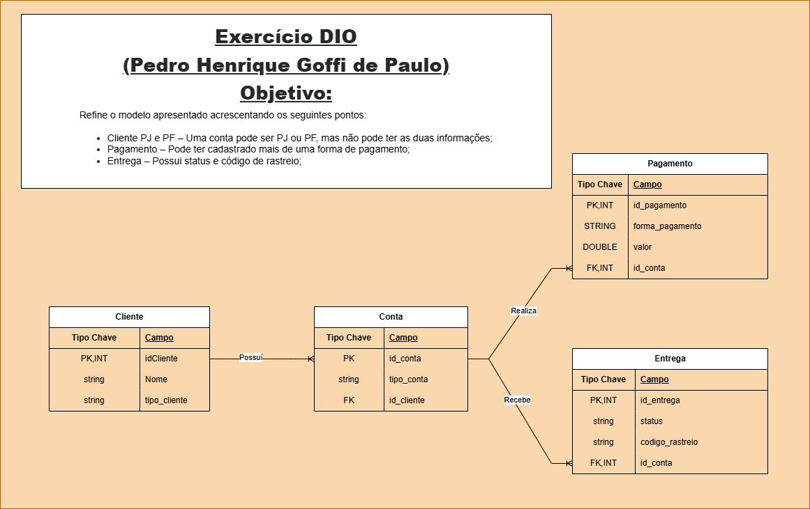

# 📌 Desafio de Modelagem de Banco de Dados

## 📝 Descrição do Projeto
Este repositório contém a modelagem conceitual de um banco de dados refinado a partir do desafio proposto. O objetivo foi criar um esquema ER considerando os seguintes pontos:

- **Cliente PJ e PF** – Uma conta pode ser PJ ou PF, mas não ambas.
- **Pagamento** – Pode ter mais de uma forma de pagamento cadastrada.
- **Entrega** – Possui status e código de rastreio.

## 🎯 Objetivo
Criar um esquema ER que represente corretamente as relações e entidades do projeto. A modelagem inclui cardinalidades e detalhes necessários para um banco de dados eficiente e bem estruturado.

## 🚀 Esquema do Banco de Dados

## 🤔 Possível Confusão…
Confesso que, em um primeiro momento, achei que o desafio era criar o site inteiro com o banco de dados funcionando! 😂 Mas depois percebi que era só a modelagem. Fica aí a reflexão sobre a vida e a importância de ler os enunciados com calma. 😆

## 🏗️ Tecnologias Utilizadas
- **Mermaid.js** para criação do diagrama
- **Markdown** para documentação
- **GitHub** para versionamento e compartilhamento
---
**Autor:** Pedro Henrique Goffi de Paulo 🚀

